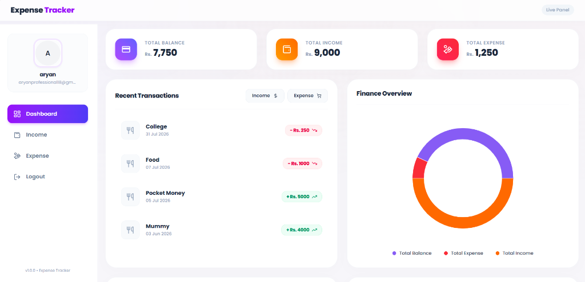

   
    
   

   
  

    
    
    
    
    
    
    
    
  

  <h1 align="center">Expense Tracker - MERN</h1>

   

     This Expense Tracker is a full-stack web application built using the MERN (MongoDB, Express.js, React, Node.js) stack. It allows users to manage their finances by adding, editing, and deleting income and expense transactions. The application provides category-based filtering, interactive charts for expense visualization, and a responsive UI for seamless usage across different devices. It also includes user authentication with JWT for secure access. The project aims to help users track their spending habits efficiently with a user-friendly and visually appealing interface. 🚀
    

